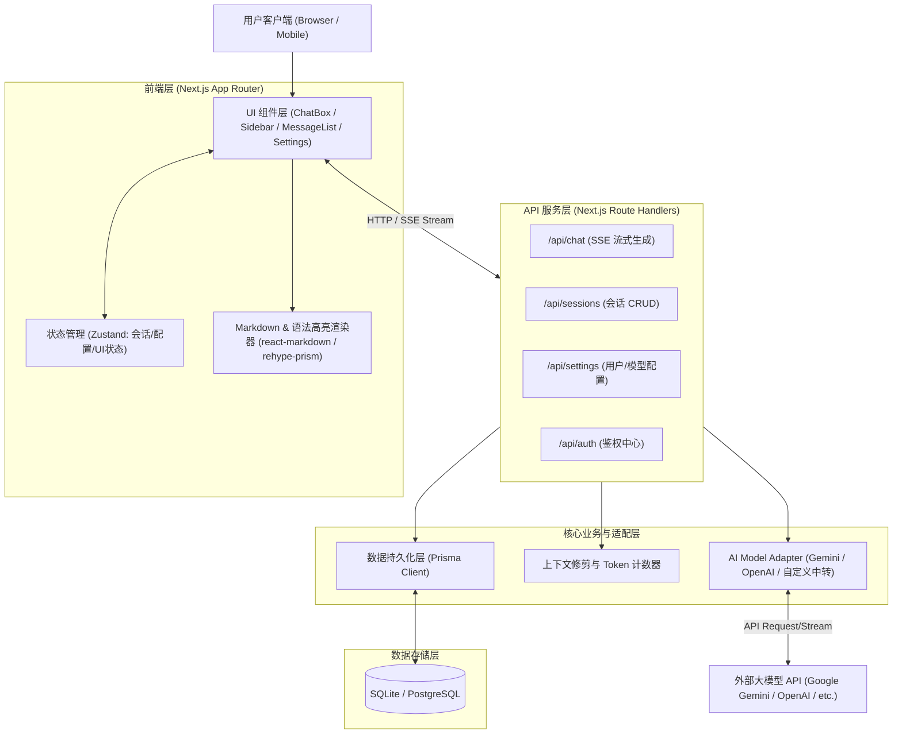

# com.igg.ai 系统架构与技术方案设计

## 1. 项目定位与核心目标
`com.igg.ai` 是一款现代化的全栈 AI 对话助手 Web 应用，致力于提供流畅、响应迅速且功能完备的多模型 AI 对话体验。

### 核心功能指标
1. **实时流式对话 (SSE Streaming)**：低延迟打字机式流式输出，支持 Markdown、代码高亮、数学公式 (LaTeX) 与表格渲染。
2. **多会话与上下文管理**：支持会话创建、命名、置顶、归档、导出与历史记录检索。
3. **模型与提示词定制 (Prompt & Model Hub)**：支持切换主流大模型（Gemini、GPT、Claude 等），提供系统提示词库与角色扮演预设。
4. **多模态与附件交互**：支持图片上传解析与多模态对话。
5. **持久化与响应式体验**：全端响应式适配（Desktop / Tablet / Mobile），支持深浅色模式切换。

---

## 2. 技术选型方案 (Tech Stack)

| 层次 | 选型 | 理由与优势 |
| :--- | :--- | :--- |
| **前端框架** | Next.js 15 (App Router) + React 19 + TypeScript | 业内成熟的现代化全栈 React 框架，支持 SSR/SSG、服务端流式渲染与高性能客户端交互 |
| **样式与组件库** | Tailwind CSS + Radix UI / shadcn/ui + Lucide Icons | 高度可定制、轻量、无头组件生态，开箱即用且易于维护企业级 UI |
| **状态管理** | Zustand + TanStack Query | 极简的状态管理与强大的数据缓存/重试机制 |
| **AI 交互层** | Vercel AI SDK (`ai` / `@ai-sdk/react`) / `@google/genai` | 原生支持流式传输 (ReadableStream/SSE)、统一的多模型适配接口与工具调用规范 |
| **后端/API 层** | Next.js Route Handlers + Edge / Node.js Runtime | 前后端一体化，部署轻量，天然支持流式 API 接口 |
| **数据库 & ORM** | Prisma / Drizzle ORM + SQLite (开发阶段) / PostgreSQL (生产阶段) | 开发期开箱即用零依赖，生产环境无缝迁移至云端 Postgres |
| **鉴权认证** | Auth.js (NextAuth v5) | 灵活支持账密、OAuth (GitHub/Google) 及免登录游客模式 |

---

## 3. 系统架构设计 (Architecture)



---

## 4. 核心模块设计

### 4.1 聊天流式交互模块 (Chat & Stream Engine)
- **协议**：采用 Server-Sent Events (SSE) 或 Vercel AI SDK 的 `DataStream` 协议。
- **客户端处理**：采用 `useChat` 钩子或自定义 SSE Reader，支持流式中断 (AbortController)、重新生成 (Retry) 与分块合并。
- **思考过程 (Reasoning Tokens)**：针对支持思考模型（如 Gemini 2.0 / DeepSeek-R1 / o3），前端实现 `<ThinkingBlock>` 折叠卡片，实时渲染思维链。

### 4.2 数据模型设计 (Database Schema)

```prisma
datasource db {
  provider = "sqlite"
  url      = env("DATABASE_URL")
}

generator client {
  provider = "prisma-client-js"
}

model User {
  id            String         @id @default(cuid())
  name          String?
  email         String?        @unique
  image         String?
  createdAt     DateTime       @default(now())
  updatedAt     DateTime       @updatedAt
  conversations Conversation[]
  settings      UserSettings?
}

model Conversation {
  id        String    @id @default(cuid())
  title     String    @default("新对话")
  userId    String?
  user      User?     @relation(fields: [userId], references: [id], onDelete: Cascade)
  pinned    Boolean   @default(false)
  model     String    @default("gemini-2.5-flash")
  systemPrompt String?
  createdAt DateTime  @default(now())
  updatedAt DateTime  @updatedAt
  messages  Message[]
}

model Message {
  id             String       @id @default(cuid())
  conversationId String
  conversation   Conversation @relation(fields: [conversationId], references: [id], onDelete: Cascade)
  role           String       // "user" | "assistant" | "system"
  content        String
  reasoning      String?      // 思维链/思考过程内容
  attachments    String?      // JSON 序列化的附件列表
  tokenCount     Int?
  createdAt      DateTime     @default(now())
}

model UserSettings {
  id             String   @id @default(cuid())
  userId         String   @unique
  user           User     @relation(fields: [userId], references: [id], onDelete: Cascade)
  defaultModel   String   @default("gemini-2.5-flash")
  temperature    Float    @default(0.7)
  theme          String   @default("system")
  apiKeyOverride String?
  updatedAt      DateTime @updatedAt
}
```

### 4.3 目录结构规划 (Project Layout)
```
com.igg.ai/
├── src/
│   ├── app/                      # Next.js App Router 路由入口
│   │   ├── (chat)/               # 对话主界面路由组
│   │   │   ├── c/[id]/page.tsx   # 指定会话页面
│   │   │   └── page.tsx          # 默认新会话页面
│   │   ├── api/                  # 后端 API 路由
│   │   │   ├── chat/route.ts     # SSE 流式聊天端点
│   │   │   ├── sessions/route.ts # 会话 CRUD
│   │   │   └── models/route.ts   # 可用模型列表
│   │   ├── layout.tsx            # 全局布局 (Theme, Sidebar, Providers)
│   │   └── globals.css           # 全局样式与 Tailwind 指令
│   ├── components/               # UI 组件库
│   │   ├── chat/                 # 对话核心组件 (MessageList, ChatInput, ThinkingBlock)
│   │   ├── sidebar/              # 侧边栏 (ConversationHistory, NewChatBtn, UserProfile)
│   │   ├── ui/                   # 基础原子组件 (Button, Dialog, Dropdown, Tooltip)
│   │   └── markdown/             # Markdown 解析器与代码高亮块
│   ├── hooks/                    # 自定义 React Hooks (useChat, useSessionList, useTheme)
│   ├── lib/                      # 工具库与服务端单例
│   │   ├── ai/                   # AI SDK 提供者与适配逻辑
│   │   ├── db/                   # Prisma 数据库客户端实例
│   │   └── utils.ts              # 常用辅助函数 (cn, formatTime, etc.)
│   ├── store/                    # Zustand 客户端状态存储
│   │   ├── useChatStore.ts       # 当前会话交互状态
│   │   └── useUIStore.ts         # 侧边栏折叠/弹窗等 UI 状态
│   └── types/                    # TypeScript 类型定义
├── prisma/
│   └── schema.prisma             # 数据库模型定义
├── public/                       # 静态资源 (Logo, Favicon)
├── package.json
├── tsconfig.json
├── tailwind.config.ts
└── README.md
```

---

## 5. 实施里程碑 (Milestones & Roadmap)

1. **阶段一：工程底座脚手架搭建 (Scaffolding & Foundation)**
   - 初始化 Next.js 15 + TypeScript + Tailwind CSS。
   - 配置 Prisma 与 SQLite 数据库，建立基础数据迁移。
   - 配置统一的主题 (Dark/Light) 与基础 UI 组件。

2. **阶段二：对话核心与流式引擎开发 (Core Chat & SSE Engine)**
   - 实现 `/api/chat` 流式响应接口与大模型接入。
   - 实现前端输入框、消息列表流式渲染、思维链展示与 Markdown 代码块高亮。

3. **阶段三：会话持久化与管理 (Session & History Management)**
   - 实现会话列表、历史记录加载、重命名与删除。
   - 支持本地离线存储与服务端数据库自动同步。

4. **阶段四：增强特性与多模态 (Enhancements & Multimodal)**
   - 多模型选择器与自定义 API Key / System Prompt 配置。
   - 图片上传与附件分析支持。
   - 响应式多端体验优化与错误重试处理。
